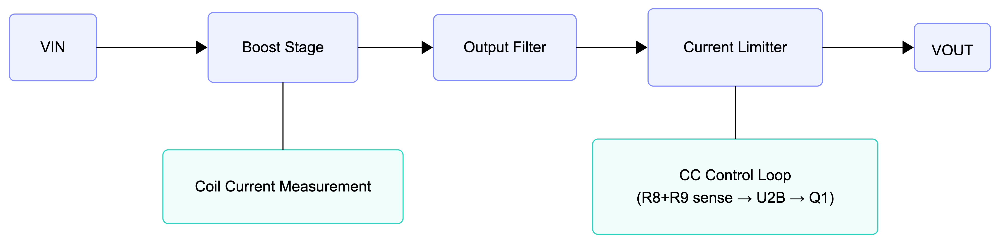
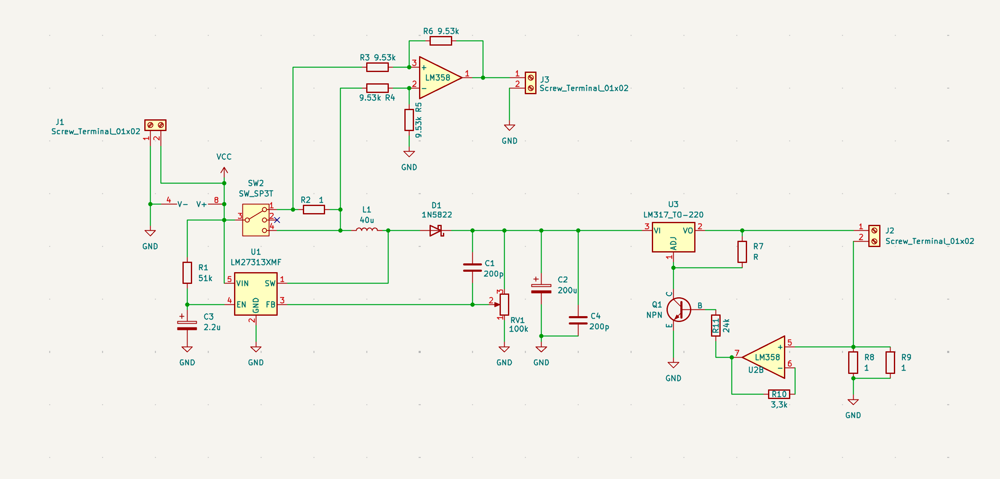
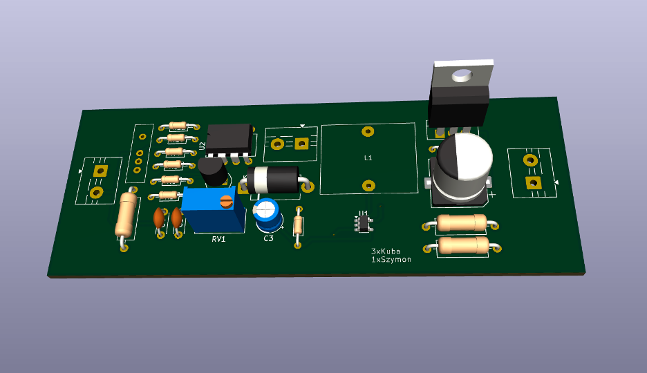
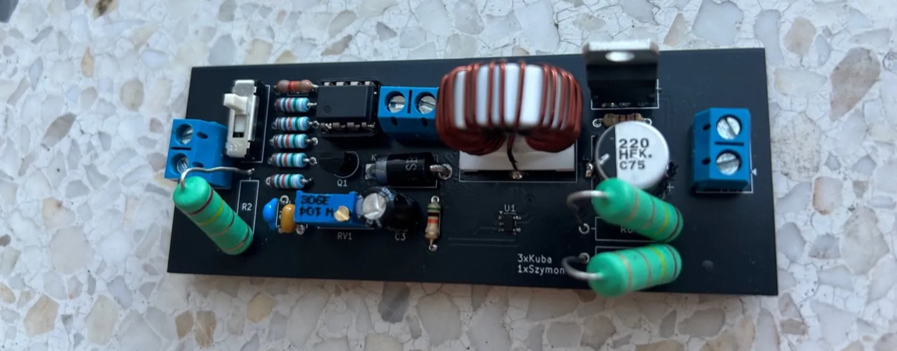
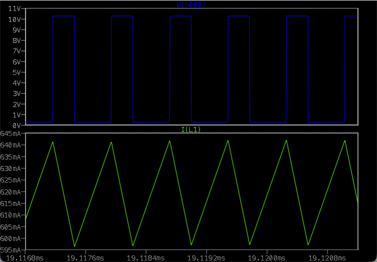
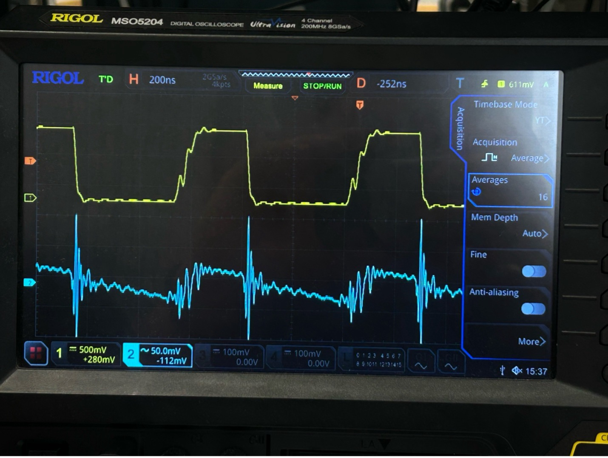

# Przetwornica Boost — README

Autorski projekt przetwornicy podwyższającej napięcie (DC-DC step-up) z regulacją napięcia wyjściowego (CV) i ograniczeniem prądowym (CC). Projekt obejmuje pełny cykl inżynierski: schemat → symulacja LTSpice → projekt PCB (KiCad) → montaż → pomiary i weryfikacja na sprzęcie.

**Projekt grupowy:** 3×Kuba, 1×Szymon

---

## Kluczowe Parametry

| Parametr | Wartość spec. |
| --- | --- |
| Częstotliwość kluczowania | ~1,6 MHz |
| Indukcyjność cewki | L1 = 40 µH |
| Pojemność wyjściowa (bulk) | C2 = 200 µF |
| Próg ograniczenia prądu (CC) | ~300 mA |
| Napięcie wyjściowe (CV) | regulowane przez RV1 |
| Napięcie wejściowe | [Vin] V |

---

## Schemat Blokowy



## Architektura Układu

### 1. Stopień Boost — LM27313XMF + L1 + D1

**LM27313XMF** to kontroler PWM przetwornicy boost o stałej częstotliwości (~1,6 MHz). Reguluje napięcie wyjściowe porównując napięcie na pinie FB z wewnętrznym napięciem referencyjnym — wyższe napięcie FB oznacza większy współczynnik wypełnienia.

Gdy wewnętrzny przełącznik (SW) zamknięty, zwiera dolny koniec cewki **L1 (40 µH)** do masy — prąd narasta, gromadząc energię w polu magnetycznym. Gdy SW otwiera się, pole opada i cewka działa jako źródło prądu napędzające wyjście do napięcia wyższego niż wejście.

**D1 (1N5822 Schottky)** — dioda swobodnego biegu. Gdy SW otwiera się, zapewnia jedyną ścieżkę przepływu prądu cewki. Bez niej zanikające pole wytworzyłoby skok napięcia niszczący U1. Schottky wybrano ze względu na niski spadek napięcia (~0,35 V vs ~0,7 V dla krzemu) i zerowy czas rekombinacji nośników odwrotnych — kluczowe przy 1,574 MHz.

**RV1 (potencjometr 100 kΩ)** ustawia napięcie na pinie FB, regulując tym samym napięcie wyjściowe. **C3 (2,2 µF)** blokuje zakłócenia HF na zasilaniu LM27313.

### 2. Filtr Wyjściowy

| Element | Wartość | Rola |
| --- | --- | --- |
| C1 | 200 pF | Ceramiczny bypass HF — tłumi szumy kluczowania |
| C2 | 200 µF | Elektrolityczny bulk — główny rezerwuar energii, stabilizuje wyjście między cyklami |
| C4 | 10 pF | Drugi bypass HF, blisko wejścia LM317 |

### 3. Pomiar Prądu Cewki — R2 + U2A

**R2 (1 Ω)** w szeregu z torem mocy (bypassowalny przez SW2). Wzmacniacz różnicowy **U2A** (LM358, R3=R4=R5=R6=9,53 kΩ, wzmocnienie = 1) mierzy spadek napięcia:

```
V_out(U2A) = I_cewki × 1 Ω
```

Wynik dostępny na **J3** do zewnętrznego pomiaru. SW2 pozwala ominąć R2 eliminując straty I²R gdy monitoring nie jest potrzebny.

### 4. Regulacja CV/CC — LM317 + U2B + Q1

**LM317 (U3)** jako liniowy regulator po stopniu boost, utrzymuje 1,25 V między OUT i ADJ. **R7** ustawia bazowe napięcie wyjściowe.

**R8 ‖ R9 = 0,5 Ω** mierzą prąd wyjściowy. **U2B** (LM358, wzmacniacz nieodwracający) wzmacnia sygnał:

```
Wzmocnienie = 1 + R11/R10 = 1 + 24k/3,3k ≈ 8,27

Przy I_out = 300 mA:
  V_sense = 0,300 × 0,5  = 0,150 V
  V_U2B   = 0,150 × 8,27 ≈ 1,24 V  ≈  V_ref(LM317) = 1,25 V
```

Gdy V_U2B ≈ 1,25 V, **Q1 (NPN)** przewodzi i ściąga pin ADJ do masy — LM317 obniża napięcie wyjściowe utrzymując I_out ≈ 300 mA (tryb CC). Poniżej progu Q1 zatkany, LM317 reguluje normalnie (tryb CV). Elegancja projektu: próg CC jest wyznaczony przez napięcie referencyjne samego LM317 — bez osobnego komparatora.

---

## Schemat i PCB

### Schemat (KiCad)



### Render 3D PCB



### Zmontowana płytka



Płytka dwuwarstwowa z wyraźną separacją torów mocy i sygnałowych. Toroidalny rdzeń cewki L1, LM317 z radiatorem, kondensatory elektrolityczne i wyjściowe listwy śrubowe.

---

## Symulacja (LTSpice)

### Prąd cewki I(L1) i sygnał kluczujący



---

## Pomiary na Sprzęcie

**Sprzęt:** Rigol MSO5204 (200 MHz, 8 GSa/s)



### Prąd cewki i sygnał kluczujący — pomiar rzeczywisty

**Obserwacja — zniekształcenia pomiaru prądu:**

Pomiar prądu cewki w rzeczywistości wykazuje znaczny szum w porównaniu do symulacji. Przyczyny:

- Sygnał przełączający LM27313 (1,574 MHz) ma bardzo krótkie czasy narastania/opadania generujące harmoniczne rzędu 10–100 MHz
- Pasożytnicza indukcyjność ścieżek PCB i elementów w pętli kluczowania tworzy impulsy napięciowe przy każdym przełączeniu
- Te szybkie transjenty są indukowane (sprzężenie pojemnościowe i indukcyjne) do ścieżki pomiaru prądu
- Efektywna szerokość pasma toru pomiaru (R2 → U2A → J3 → sonda) jest ograniczona, co wypacza kształt sygnału

Wyniku nie należy interpretować jako błędu układu — przetwornica działa poprawnie, co potwierdza pomiar częstotliwości.

### Pomiar częstotliwości kluczowania

> 📎 Wstaw zdjęcie z oscyloskopu — pomiar kursorem (Δx = 635 ns)
> 

| Parametr | Wartość |
| --- | --- |
| Zmierzona częstotliwość | **1,574 MHz** |
| Metoda pomiaru | kursor ΔX: Δx = 635 ns → f = 1/635 ns |
| Specyfikacja LM27313 | ~1,6 MHz (typ.) |
| Odchyłka od specyfikacji | **1,6%** — w granicach tolerancji |

---

## Uwagi do Layoutu PCB

- **Tor mocy (VIN → L1 → D1 → C2 → LM317 → J2):** krótkie i szerokie ścieżki — każda dodatkowa impedancja w tej pętli pogarsza sprawność i zwiększa EMI
- **Kondensatory blokujące (C3, C1, C4):** umieszczone jak najbliżej pinów zasilania układów scalonych
- **Rezystory pomiarowe (R2, R8, R9):** połączenia Kelvin (oddzielne ścieżki prądu i pomiaru) eliminują błąd od rezystancji ścieżki
- **Masa:** ciągłe wypełnienie miedzią z separacją głośnego prądu kluczowania od cichego toru analogowego (LM358, dzielnik FB)
- **Punkty testowe:** VIN, węzeł SW (U1 pin 1), wyjście L1/anoda D1, VOUT, J3 (monitor cewki)

---